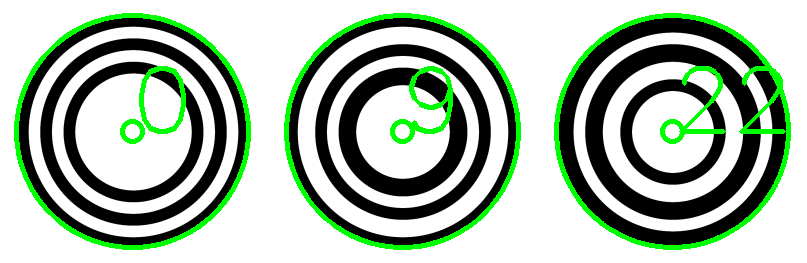

Library usage
=============

Detecting the markers requires three main entities:

* the class :cpp:class:`cctag::CCTag` modeling a single marker

* and the functions :cpp:func:`cctag::cctagDetection()` to process the images and get the list of detected markers.

* the struc :cpp:struct:`cctag::Parameters` that control the detection algorithm through the various parameters that it exposes.

Detection
~~~~~~~~~

Here is a minimal sample of code that enable CCTag detection on an image:

.. code-block:: c++
  :linenos:
  :emphasize-lines: 3,19,20

  // set up the parameters
  const std::size_t nCrowns{3};
  cctag::Parameters params(nCrowns);
  // if you want to use GPU
  params.setUseCuda(true);

  // load the image e.g. from file
  cv::Mat src = cv::imread(image_filename);
  cv::Mat graySrc;
  cv::cvtColor(src, graySrc, CV_BGR2GRAY);

  // choose a cuda pipe
  const int pipeId{0};

  // an arbitrary id for the frame
  const int frameId{0};

  // process the image
  boost::ptr_list<ICCTag> markers{};
  cctagDetection(markers, pipeId, frameId, graySrc, params);

@TODO maybe explain what cuda pipe means

Process detected markers
~~~~~~~~~~~~~~~~~~~~~~~~

Here is a simple example on how to process the detected markers.
The function :code:`drawMarkers` takes the list of detected markers and it overlay their information on the original image.
From the list of markers, if the detected marker is valid it draws the center of the marker, its ID and
the outer ellipse :cpp:class:`cctag::numerical::geometry::Ellipse`, all in green.
If the marker is not valid, draw the center and the ID in red.

.. code-block:: c++
  :linenos:
  :emphasize-lines: 13

  void drawMarkers(const boost::ptr_list<ICCTag>& markers, cv::Mat& image)
  {
      // drawing settings
      const int radius{10};
      const int fontSize{3};
      const int thickness{3};
      const int fontFace{cv::FONT_HERSHEY_SIMPLEX};

      for(const auto& marker : markers)
      {
          // center of the marker
          const cv::Point center = cv::Point(marker.x(), marker.y());
          const auto rescaledOuterEllipse = marker.rescaledOuterEllipse();

          // check the status and draw accordingly, green for valid, red otherwise
          if(marker.getStatus() == status::id_reliable)
          {
              const cv::Scalar color = cv::Scalar(0, 255, 0, 255);
              // draw the center
              cv::circle(image, center, radius, color, thickness);
              // write the marker ID
              cv::putText(image, std::to_string(marker.id()), center, fontFace, fontSize, color, thickness);
              // draw external ellipse
              cv::ellipse(image,
                          center,
                          cv::Size(rescaledOuterEllipse.a(), rescaledOuterEllipse.b()),
                          rescaledOuterEllipse.angle() * 180 / boost::math::constants::pi<double>(),
                          0,
                          360,
                          color,
                          thickness);
          }
          else
          {
              // the same for invalid markers but in red
              const cv::Scalar color = cv::Scalar(0, 0, 255, 255);
              cv::circle(image, center, radius, color, thickness);
              cv::putText(image, std::to_string(marker.id()), center, fontFace, fontSize, color, thickness);
          }
      }
  }

Here is an example of possible result:

