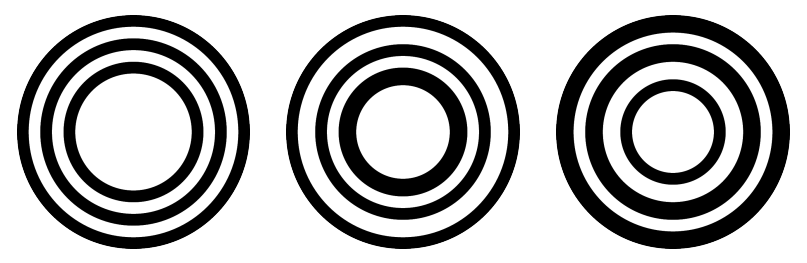
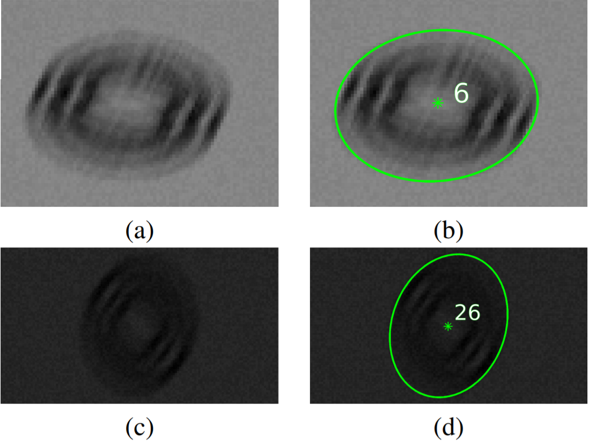

CCTag Library
=============

This library provides the code for the detection of CCTag markers made up of concentric circles :cite:`calvet2016Detection`.
CCTag markers are a robust, highly accurate fiducial system that can be robustly localized in the image even under challenging conditions.
The library can efficiently detect the position of the image of the (common) circle center and identify the marker based on the different ratio of their crown sizes.

An example of three different CCTag markers with three crowns.
Each marker can be uniquely identified thanks to the thickness of each crown, which encodes the information of the marker, typically a unique ID.

The implementation is done in both CPU and GPU (Cuda-enabled cards).
The GPU implementation can reach real-time performances on full HD images.

Example of detection in challenging conditions
~~~~~~~~~~~~~~~~~~~~~~~~~~~~~~~~~~~~~~~~~~~~~~

Examples of synthetic images of circular fiducials under very challenging shooting conditions i.e., perturbed, in particular, by a (unidirectional) motion blur of magnitude 15px.
The markers are correctly detected and identified (b,d)  with an accuracy of 0.54px and 0.36px resp. in (a) and (c) for the estimated imaged center of the outer ellipse whose semi-major axis (in green) is equal to 31.9px and 34.5px resp.

Comparison with ARToolkitPlus
~~~~~~~~~~~~~~~~~~~~~~~~~~~~~

.. raw:: html

  <iframe width="560" height="315" src="https://www.youtube.com/embed/AkfnvSfWIvg" frameborder="0" allow="accelerometer; autoplay; clipboard-write; encrypted-media; gyroscope; picture-in-picture" allowfullscreen></iframe>

The video shows the effectiveness and the robustness of the detection compared to the ARToolKitPlus :cite:`artkp`.
ARTKPlus is, among all the available open-source solutions, one achieving better performances in terms of detection rate and computational time.

In the video, 4 markers for each solution are placed on a plane at known positions, so that the relevant plane-induced homography can be estimated.
For ARTKPlus once all the markers are detected and identified, the homography is estimated  using all the detected marker corners following a DLT approach :cite:`hartley` (note that the homography can be then estimated even if only one marker is detected).
For CCTAG, the image of the four centres of the concentric circles is used to compute the homography.

The image placed in between the markers can be then rectified in order to visually assess the quality of the estimated homography.
Thanks to the accurate estimation of the image of the four centres of the concentric circles provided by CCTag, the homography can be robustly estimated and the rectified image is not affected by any significant jittering, whereas the rectified image computed
with the ARTKPlus homography is more unstable.
Moreover, the video shows that the proposed method allows detecting the marker even in very challenging conditions, such as severe motion blur and sudden illumination changes.

.. toctree::
   :maxdepth: 2
   :hidden:
   :caption: Install

   install/install

.. toctree::
   :maxdepth: 2
   :hidden:
   :caption: API Documentation

   api/usage
   api/api

.. toctree::
   :maxdepth: 2
   :hidden:
   :caption: Markers

   markers/markers

.. toctree::
   :maxdepth: 2
   :hidden:
   :caption: About

   about/about

.. toctree::
   :maxdepth: 2
   :hidden:
   :caption: References

   bibliography
